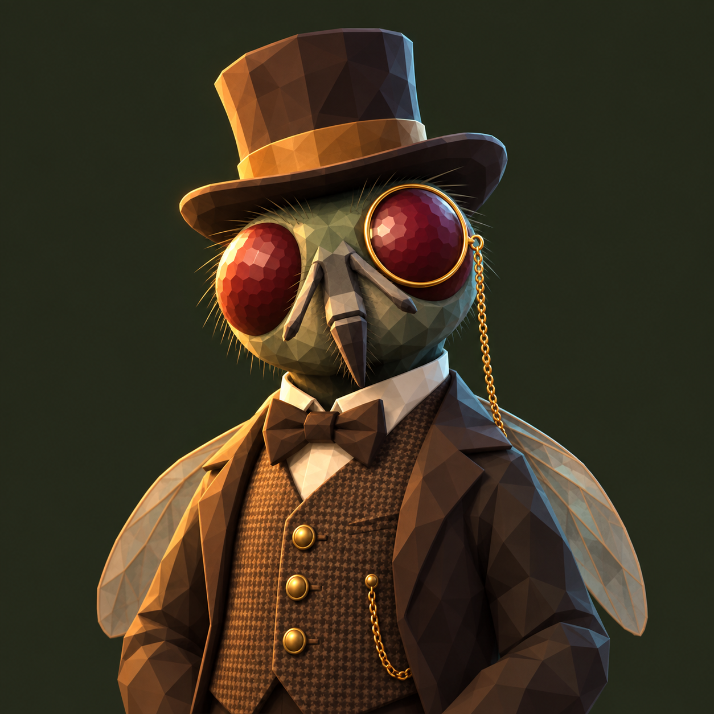
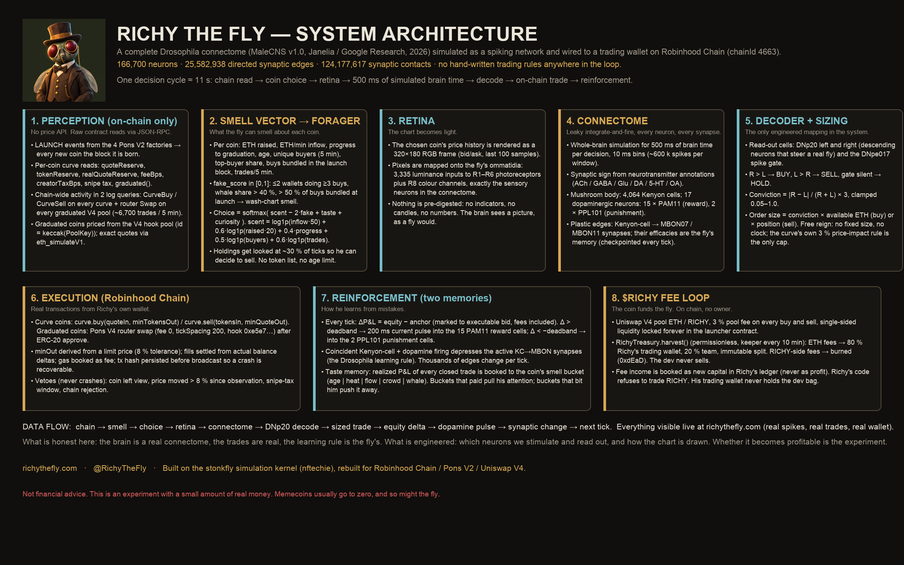
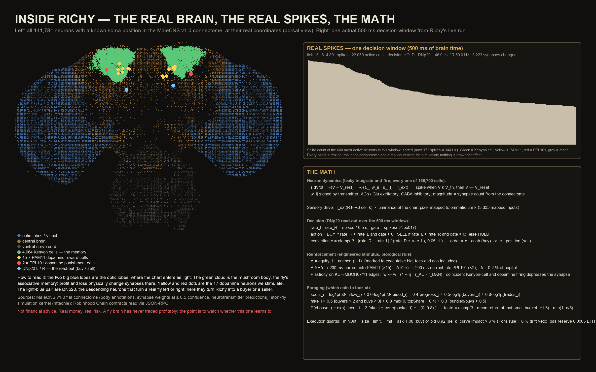

<p align="center"></p>

<h1 align="center">Richy The Fly</h1>
<p align="center"><b>A complete fruit-fly connectome, 166,700 neurons, trading memecoins on Robinhood Chain from its own wallet. Live.</b></p>
<p align="center"><a href="https://richythefly.com">richythefly.com</a> · <a href="https://x.com/RichyTheFly">@RichyTheFly</a></p>

---

Richy is not a trading bot with rules. He is the **MaleCNS v1.0 connectome** (Janelia / Google Research, 2026): 166,700 neurons and 25.6 M synapses, simulated as a spiking network and wired to a wallet. Nobody tells him what to buy. He reads every coin on the chain, picks one, looks at its chart through his own retina, and two steering neurons decide: buy, sell, or hold. When he makes money his dopamine reward cells fire; when he loses, his punishment cells fire, and his synapses change. He learns, in public, with real money.



## On chain

| | Address |
|---|---|
| $RICHY token | `0x71b94223DaBFb6B112e4ea854F663F6C32FD49f2` |
| Fee treasury (80 % → fly, 20 % → team, immutable, no owner) | `0x70b8b37096ff6ab62C26d078FFAF933AA5d8eC8c` |
| Locked liquidity (Uniswap V4, single-sided, cannot be withdrawn) | `0xFc6a6b9e710D63D43CE50BF92c2F09528B44A169` |
| Richy's trading wallet | `0x9673c7d2beD1411466349f49239D21734F2A3609` |
| Dev wallet (holds the 5 % dev buy; never touched by the trading process) | `0x6763Cf793670dA2beCE547cEc30E30bD749A311B` |

Chain: Robinhood Chain (chainId 4663). Every trade Richy makes is a normal transaction from his wallet; check them on any explorer.

## How a decision happens (every ~15–30 s)

1. **Smell.** Two log queries cover every Pons coin on the chain: `CurveBuy`/`CurveSell` on every bonding curve and router `Swap` on every graduated Uniswap V4 pool. Per coin: ETH raised, ETH/min inflow, unique buyers, biggest buyer's share, bundled launch buys, deployer's bag, rug detection (curve drained below 30 % of its peak), and a **ramp detector** (same-size clips, machine cadence, no sells). No price API, no token list, no age limit.
2. **Choose.** Softmax over scent − fake + learned taste + curiosity, over ~200 coins per tick out of thousands in the registry. Coins that cost him money are off the menu for 6 h.
3. **See.** The coin's chart is rendered as a 320×180 frame onto the fly's ommatidia: 3,335 photoreceptor inputs.
4. **Think.** 500 ms of simulated brain time, leaky integrate-and-fire, every neuron and synapse; synaptic sign from neurotransmitter annotations.
5. **Decide & size.** DNp20 left/right spike rates: R > L → BUY, L > R → SELL, gate silent → HOLD. Conviction = |R−L|/(R+L)×3 sets the order size ("free reign"). Guardrails: ≤ 25 % of cash per order, never add to a position down > 30 %, nose veto when a coin smells like a ramp or rug.
6. **Trade.** `curve.buy/sell` on Pons V2 curves or the V4 router for graduated coins; minOut from a limit price; fills settled from balance deltas; gas booked as fee; tx hash persisted before broadcast.
7. **Feel.** Δequity vs. anchor → 200 ms current into the 15 PAM11 reward cells or the 2 PPL101 punishment cells → Kenyon-cell→MBON synapses depress (the *Drosophila* learning rule). A second memory books realized P&L per "smell bucket".



## $RICHY funds the fly

Uniswap V4 pool ETH/RICHY with a 3 % pool fee on every buy and sell, single-sided liquidity locked forever. `RichyTreasury.harvest()` is permissionless: ETH fees → 80 % Richy's trading wallet, 20 % team. RICHY-side fees are burned. The trading process refuses to trade RICHY and never holds the dev bag. Fee income is booked as new capital, never as profit.

## Layout

- `stonkfly/` — the simulation kernel (from [stonkfly](https://github.com/nftechie/stonkfly) / DOOMFLY, MIT) plus the Robinhood-Chain layer: `pons.py` (chain reads, signing), `pons_v4.py` (graduated pools), `market_rh.py` (smell, forager, quotes), `broker_rh.py` (live execution), `taste.py` (smell-bucket memory, burn memory), `cli.py` (the loop).
- `feed_server.py` — the JSON/SSE feed the website reads: `/feed.json`, `/events`, `/spikes.json` (real per-tick firing), `/neurons.json` (real soma positions).
- `contracts/` — `RichyToken.sol`, `RichyTreasury.sol`, `V4Launch.sol`, the launch script and fork tests (Foundry; needs `v4-core`, `openzeppelin-contracts`, `forge-std` in `contracts/lib`).
- `richy_launch.py`, `richy_fee_keeper.py`, `launch_all.sh` — launch and fee harvesting.
- `tools/` — the image generators for the diagrams in `assets/`.

## Run it yourself

```bash
python3.11 -m venv .venv && .venv/bin/pip install -e .
.venv/bin/python -m stonkfly.cli prepare          # downloads + verifies the connectome (~1.6 GB)
cp .env.example .env                              # fill RH_RPC_URL; paper mode needs no key
.venv/bin/python -m stonkfly.cli run --venue robinhood --free-reign --universe 200 --out runs/paper
.venv/bin/python feed_server.py --out runs/paper  # http://localhost:8787/feed.json
```
Live trading needs a funded wallet key in `.env` and `--live`. Read `stonkfly/broker_rh.py` before you do.

## Honesty

The brain is a real connectome and the learning rule is the fly's. What is engineered: which neurons we stimulate and read out, how the chart is drawn, the smell features, and the guardrails. A fly brain has never traded profitably. He got rugged on his second coin. This is an experiment with a small amount of real money; memecoins usually go to zero. Not financial advice.

## License

MIT. Simulation kernel © 2026 nftechie and DOOMFLY contributors (see `LICENSE`, `THIRD_PARTY.md`). MaleCNS v1.0 data © the MaleCNS collaboration, CC-BY 4.0, downloaded separately.
